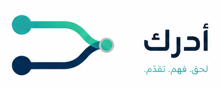

<div align="center">



# أدرك · ADRAK

**منصة تعليم تكيفي Offline-first لمعالجة الفاقد التعليمي — مصمَّمة من داخل غزة.**
_Adaptive, offline-first learning-recovery platform — built inside Gaza._

</div>

---

## المشكلة

مئات آلاف الطلاب في غزة خسروا سنوات دراسية. المشكلة ليست «تأخّر بسيط» — طالب في الصف التاسع قد يكون مستواه الفعلي في الرياضيات صف رابع. تدريسه منهاج التاسع **لا يفيده إطلاقاً**، لأنه يفتقد المتطلبات السابقة.

## الحل

أدرك يحدّد **المستوى الحقيقي** لكل طالب في ~١٢ سؤالاً عبر بحث ثنائي على شبكة المهارات، ثم يبني له **مسار تعافٍ شخصياً** يبدأ من أول فجوة حقيقية — ويعمل **بدون إنترنت بالكامل**.

هذه رقمنة لمنهجية **Teaching at the Right Level (TaRL)**، وهي من أكثر تدخّلات معالجة الفاقد التعليمي دعماً بالأدلة التجريبية عالمياً.

## لماذا هو مختلف

| | |
|---|---|
| 🔌 **Offline-first حقيقي** | كل شيء يعمل بلا إنترنت: التشخيص، التمارين، الإتقان، فتح المهارات. الإنترنت للمزامنة فقط. |
| 📷 **مزامنة ضوئية بلا بنية تحتية** | الطالب يعرض تقدّمه كرمز QR والمعلّم يمسحه. صفر إنترنت، صفر راوتر، صفر إقران. |
| 🧠 **تحليلات المفاهيم الخاطئة** | لا نقول للمعلّم «١٢ طالباً رسبوا» — نقول «١٢ طالباً يجمعون البسط والمقام». الخطأ يتحوّل إلى تشخيص. |
| 📱 **وضع الجهاز المشترك** | ٥ طلاب على هاتف واحد بملفات معزولة — واقع غزة، لا افتراض. |
| 🎫 **دخول بلا كتابة** | كرت QR مطبوع يحمله الطالب. على جهاز مشترك مشروخ الشاشة، الدخول رفعُ كرت لا كتابةُ كلمة سر. |
| 🔋 **مصمَّم للقيد** | حزمة ≤ 200KB · يعمل على 2G · وضع توفير بطارية · فاتح افتراضياً وداكن متاح. |
| 💚 **تصميم واعٍ بالصدمة** | لا مؤقتات · لا ترتيب تنافسي · لا علامات خطأ حمراء. مهارة نبنيها، لا اختبار نرسب فيه. |

## البنية

```
adrak/
├─ api/            Laravel 12 · API-only · Sanctum · MariaDB
├─ web/            React 19 · TypeScript · Vite · PWA · Dexie (IndexedDB)
├─ engine-spec/    مواصفة الخوارزمية + متجهات اختبار مشتركة  ← مصدر الحقيقة
├─ content/        شبكة المهارات وبنك الأسئلة
├─ design/         الهوية البصرية ونظام التصميم
├─ docs/           خطة التنفيذ في غزة · إجابات استمارة التسجيل
├─ video/          مشروع Remotion — الفيديو التعريفي (٧٨ ثانية)
├─ deploy/         nginx · سكربت النشر · دليل الخادم
└─ .github/        بوابات CI — كل رقم في هذا الملف يُفحص آلياً على كل دفعة
```

### `engine-spec/` — لماذا هو موجود

المحرّك التكيفي يعمل في **مكانين**: على جهاز الطالب (TypeScript، بدون إنترنت) وعلى الخادم (PHP، كمرجع نهائي). أي تباعد بينهما = بيانات فاسدة.

الحل: **متجهات اختبار JSON واحدة** يشغّلها Pest و Vitest معاً. أي اختلاف في السلوك = اختبار أحمر فوراً.

## التشغيل محلياً

```bash
# Backend
cd api && composer install && cp .env.example .env && php artisan key:generate
php artisan migrate

# المنهاج ثم الصف التجريبي — بهذا الترتيب، فالصف يشير إلى المهارات.
# `migrate --seed` وحده يشغّل بذرة Laravel الافتراضية ويترك التطبيق بلا منهاج ولا صف.
php artisan adrak:seed-content
php artisan adrak:demo-reset --force

php artisan serve --port=8001

# Frontend  (منفذ آخر — الواجهة تُوكِّل /api إلى 8001)
cd web && npm ci && npm run dev
```

يفتح على `http://127.0.0.1:5173` — «جرّب كطالب» يدخلك بضغطة. رمز الصف `ADRAK6` والرقم السري `1234`، والمعلّم `teacher@adrak.demo` / `adrak-demo`.

## الاختبارات

```bash
cd api && ./vendor/bin/pest                              # API + متجهات المحرّك
cd api && ./vendor/bin/phpstan analyse --memory-limit=1G # تحليل ساكن level 6
cd web && npm run test                                   # نفس متجهات المحرّك على العميل

node tools/check-contrast.mjs   # ٣٤ زوج لون، WCAG 2.2 AA في الوضعين
node tools/check-bundle.mjs     # ميزانية ٢٠٠KB على 2G
```

كل ما سبق يعمل في `.github/workflows/ci.yml` على كل دفعة ودمج — التباين، وميزانية الحزمة، وأن `tokens.css` مولَّد لا مكتوب بيد. الاختبار الطرفي وحده خارج الـ CI عمداً: يقود متصفّحاً حقيقياً ضدّ API يُشغَّل يدوياً، ونسخةٌ منه في الـ CI تختبر شيئاً آخر غير الذي يقوم عليه ادعاء العمل بلا إنترنت.

`phpstan` يحتاج `--memory-limit=1G` صراحةً: افتراض PHP هو 128M، وعنده تنهار عملية فرعية برسالة تبدو كخطأ في الكود وليست كذلك.

الاختبار الطرفي يحتاج الـ API شغّالاً — لا يشغّله بنفسه، عمداً، كي لا يمسح صفاً تجريبياً ينظر إليه أحدهم:

```bash
cd api && php artisan serve --port=8001    # في طرفية
cd web && npm run test:e2e                 # في أخرى
```

---

<div align="center">
<sub>بُني في غزة · Built in Gaza</sub>
</div>
